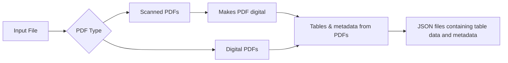

# PDF Table Extraction Pipeline

This project is a two-step pipeline for converting scanned PDFs into digital PDFs and extracting tables from them into JSON format using OCR and table recognition tools.

## Features

- Converts scanned PDFs into digital PDFs using PDF.co API
- Extracts tables from searchable PDFs using Camelot
- Saves extracted tables and metadata to structured JSON files

---

## Requirements

- Python 3.7+
- PDF.co API Key (required for OCR)
- Required Python packages:
  - `requests`
  - `camelot-py[cv]`
  - `PyMuPDF` (fitz)
  - `cryptography`

---

## Installation

**Clone the Repository**
   ```bash
   git clone <your-repo-url>
   cd <your-project-directory>
   ```
---

## Install Dependencies
   ```bash
   pip install -r requirements.txt
   ```
---

**If requirements.txt is not present, manually install:**
   ```bash
   pip install requests camelot-py[cv] PyMuPDF cryptography
   ```
## Configure API Key
**Create a config.py file in the root directory and insert your PDF.co API key:**
  ```bash
  API_KEY = "your_pdf_co_api_key_here"
  ```

---

## Usage
**Run the project using the main script:**
  ```bash
  python main.py
```

## Steps to run the project 
**Select Input file(s)**

Place all the pdf files in the input folder and select the files to be processed

All the files in the directory will be displayed
```bash
Available PDF files:
1. Document1.pdf
2. Document2.pdf
3. Document3_scanned.pdf
Enter the file numbers to process ('1-3' for a range, or '1,3,5' for multiple files):
```
If the selected pdf file is scanned the pdf is converted into digital pdf
```bash
The file 'Document2_scanned.pdf' is scanned. Converting to searchable PDF...
Searchable PDF saved as: c:\<your-project-directory\input\Document3_scanned_searchable.pdf
```
The output will be saved as <filename>_searchable.pdf.

Then the extract tables function will run

**Extract tables**

Provide page ranges (e.g., 1-3, 1,3,5) as prompted
```bash
Enter the page ranges to extract tables for 'Document2.pdf' (e.g., '1-3' or '1,2,3'): 2
```
---

## Output
Extracted data will be saved as JSON in the output folder.

```bash
Extracted table data saved to c:\<your-project-directory\output\Document2_tables.json
```

The project will generate JSON files containing:

Extracted tables (headers and rows)

PDF metadata (e.g., title, author, producer, etc.)


## Notes

The pipeline expects all PDF files to be in the input folder.

An internet connection is required for OCR via the PDF.co API.

For large or complex tables, you may modify Camelot’s parsing mode (stream or lattice) in table_extraction.

